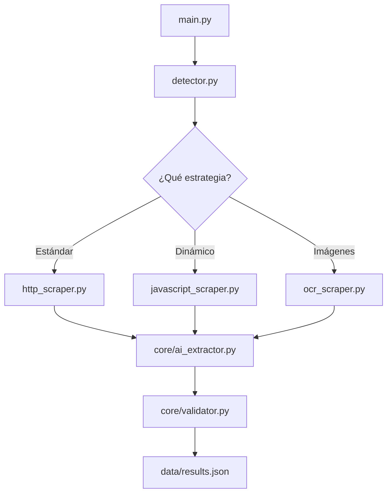

# Arquitectura: ScrapPoliticos

El proyecto sigue una **Vertical Slice Architecture**, donde cada estrategia de scraping es autónoma y modular.

## Componentes Principales

### 1. Core (`/core`)

- **`ai_extractor.py`**: Interfaz con OpenRouter para la extracción estructurada.
- **`validator.py`**: Limpieza y validación de datos (emails, nombres, cargos).
- **`retry_handler.py`**: Decoradores para reintentos con backoff.
- **`logger.py`**: Configuración de logging unificada.
- **`detector.py`**: Orquestador que selecciona la mejor estrategia para cada municipio.

### 2. Scrapers (`/scrapers`)

- **`base.py`**: Clase abstracta que define la interfaz común.
- **`http_scraper.py`**: Estrategia estándar para sitios estáticos.
- **`javascript_scraper.py`**: Uso de Playwright para sitios dinámicos.
- **`ocr_scraper.py`**: Uso de Tesseract para información en imágenes.

### 3. Configuración (`/config`)

- **`domains.json`**: Lista maestra de dominios.
- **`special_cases.json`**: Casos que requieren JS u OCR.
- **`alternative_routes.json`**: Rutas conocidas donde hay datos.

## Flujo de Trabajo

## Robustez

- **Detección Automática**: El sistema puede cambiar de estrategia si detecta que una falla o si hay configuraciones previas.
- **Reintentos**: Cada petición HTTP o llamada de IA tiene reintentos configurados.
- **Validación Estricta**: Los datos mal formados se descartan o limpian antes de guardarse.
